# ArtLink

갤러리와 아티스트를 잇다 : ArtLink

ArtLink은 갤러리와 아티스트를 연결하는 플랫폼입니다. 아티스트는 갤러리의 공모에 지원하고, 갤러리는 아티스트를 발견할 수 있습니다.

## 기술 스택 (Tech Stack)

- **프론트엔드**: React + Vite + TypeScript
- **백엔드**: Express + Prisma + PostgreSQL
- **상태 관리**: TanStack Query (서버), Zustand (클라이언트)
- **UI/스타일링**: Shadcn/ui, Tailwind CSS, Framer Motion
- **인증**: Auth.js
- **폼/검증**: React-hook-form, Zod
- **품질 관리**: ESLint, Prettier, Vitest

## 주요 기능

### 사용자 역할
- **아티스트 (Artist)**: 포트폴리오 관리, 갤러리 찜, 공모 지원, 리뷰 작성
- **갤러리 (Gallery)**: 갤러리 등록, 공모 등록, 홍보 관리
- **관리자 (Admin)**: 승인 관리, Hero 섹션 관리, 혜택 관리, 이달의 갤러리 선정

### 주요 화면
- 홈: Hero 슬라이더, 퀵 액션 카드, 이달의 갤러리
- 갤러리 찾기: 갤러리 목록, 필터링, 찜 기능
- 갤러리 상세: 정보, 리뷰, 진행 중 공고
- 모집 공고: D-day 공고 목록, 지원 기능
- 혜택: 관리자가 등록한 혜택 정보
- 마이페이지: 프로필, 포트폴리오, 찜 목록, 활동 내역

## 데이터베이스 ERD



## 설치 및 실행

### 사전 요구사항
- Node.js (v18 이상)
- PostgreSQL
- Docker (선택사항, docker-compose 사용 시)

### 백엔드 설정
1. `backend` 폴더로 이동:
   ```bash
   cd backend
   ```

2. 의존성 설치:
   ```bash
   npm install
   ```

3. 환경 변수 설정: `.env` 파일 생성 (DATABASE_URL 등)

4. 데이터베이스 마이그레이션:
   ```bash
   npm run db:migrate
   ```

5. Prisma 클라이언트 생성:
   ```bash
   npm run db:generate
   ```

6. 시드 데이터 추가 (선택):
   ```bash
   npm run db:seed
   ```

7. 개발 서버 실행:
   ```bash
   npm run dev
   ```

### 프론트엔드 설정
1. `frontend` 폴더로 이동:
   ```bash
   cd frontend
   ```

2. 의존성 설치:
   ```bash
   npm install
   ```

3. 개발 서버 실행:
   ```bash
   npm run dev
   ```

### Docker를 사용한 실행 (선택)
```bash
docker-compose up
```

### 자동 실행 스크립트
프로젝트 루트에서 `./run_web.sh` 실행으로 웹 서버를 시작할 수 있습니다.

## 명령어

### 프론트엔드
- `npm run dev`: 개발 서버 실행
- `npm run build`: 프로덕션 빌드
- `npm run test`: Vitest 테스트 실행

### 백엔드
- `npm run dev`: 개발 서버 실행
- `npm run build`: TypeScript 컴파일
- `npm run start`: 프로덕션 서버 실행
- `npm run db:migrate`: DB 마이그레이션
- `npm run db:generate`: Prisma 클라이언트 생성
- `npm run db:seed`: 시드 데이터 추가
- `npm run db:studio`: Prisma Studio 실행

## 프로젝트 구조

```
ArtLink/
├── backend/          # Express 백엔드
│   ├── prisma/       # 데이터베이스 스키마 및 마이그레이션
│   ├── src/          # 소스 코드
│   └── uploads/      # 파일 업로드
├── frontend/         # React 프론트엔드
│   ├── public/       # 정적 파일
│   └── src/          # 소스 코드
├── docs/             # 문서
└── run_web.sh        # 자동 실행 스크립트
```

## 기여

이 프로젝트는 CLAUDE.md에 정의된 사양에 따라 개발되었습니다. 변경 시 사양을 준수해주세요.

## 라이선스

이 프로젝트는 MIT 라이선스를 따릅니다.